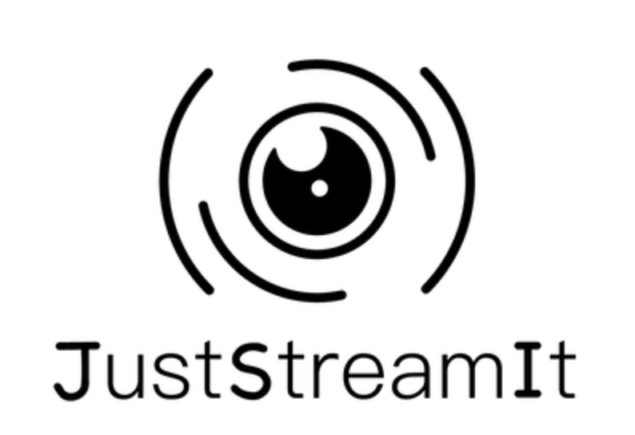

# Bienvenue dans le README du projet JustStreamIt !

JustStreamIt est un projet pédagogique ayant pour objectif de fournir une base
solide mais simple pour le back-end d'un projet d'étude. Ce back-end est
réalisé avec le langage Python et le micro-framework web Flask.



## Dépendances de l'application et installation
Comme recommandé dans la [documentation sur le packaging de Python](https://packaging.python.org/tutorials/managing-dependencies/), 
ce projet utilise le module pipenv pour gérer ses dépendances ainsi que la 
création et de l'environnement virtuel. Si vous n'utiliser pas encore pipenv,
vous pouvez l'installer en suivant les recommandations d'installation [décrite
ici](docs/pipenv/installation-fr.md).

Les dépendances de l'application sont fournie dans un fichier Pipfile joint
au dépôt de code du projet. Une fois pipenv installé, vous voulez les installer
avec une commande unique identique sur tous les systèmes d'exploitation:

```
$ pipenv install --dev
```

## Lancement du serveur et vérification du bon fonctionnement

Une fois les dépendances installées à la section précédance, le serveur 
lance avec la commande suivante:

- Activer l'environnement virtuel: `$ pipenv shell`
- Lancer le serveur de développement de Flask: `$ flask run`

Une fois que vous avant lancé ce serveur, vous pouvez accéder à la page d'accueil
en ouvrant l'url [http://127.0.0.1:5000/](http://127.0.0.1:5000/) dans un
navigateur web.

## Installation de nouvelles dépendance selon les besoins

Pour installer vos propres dépendances python au sein du projet, il vous suffit
d'excuter la commande suivante:

- Si c'est une dépendance du projet: `pipenv install <la bibliothèque que je désire>`
- SI c'est une dépendance de développement comme flake8: `pipenv install --dev flake8`

## Structure de l'application et de ses répertoires

Ce projet est organisé de cette manière:
- `juststreamit/`: paquet principal de l'application
    - `__init__.py`: initialisation de l'application
    - `clients.py`: module que vous pouvez utiliser pour requêter l'API
    - `views.py`: module définissant les vues de l'application web. Ce sont ces fonctions qui répondent aux requêtes http du navigateur.
    - `templates/`:
        - `base.html`: Template HTML donnant la structure de base de toutes
        les pages du projet. Il se trouve dans le dossier templates comme
        Flask le demande (un projet Flask utilise le pattern Modèle-Vue-Template ou MVT).
        - `index.html`: Template HTML personnalisant base.html pour décrire la
        structure de la page d'accueil. Il est possible de construire d'autres
        templates en suivant le modèle de `index.html`.
    - `static`:
        - `css/`: Répertoire contenant toutes les feuilles de style du projet.
            - `styles.css`: Le fichier CSS décrivant les styles du projet. Il 
            se trouve dans le dossier static comme Flask le demande.
        - `img/`: Répertoire contenant les éventuels fichiers image du projet.
        - `js/`: Répertoire contenant les éventuels fichiers javascript du projet.


Chaque modification que vous effectuerez dans le fichier html ou css sera visible après avoir rechargé la page. Vous devez évidemment vous assurer que le serveur tourne toujours et le relancer si nécessaire avec les commandes:

- Activer l'environnement virtuel: `$ pipenv shell`
- Lancer le serveur de développement de Flask: `$ flask run`

ou en une ligne:

```
$ pipenv run flask run
```

Pour afficher des variables Python dans la page HTML, vous devez les passer en 
paramètre render_template comme illustré dans views.py. La syntaxe des doubles 
accolades ouvrantes et fermantes {{ variable_a_afficher }} permet ensuite d'insérer 
ces variables au de la page html traitée par render_template. La valeur se 
trouvant dans les doubles accolades est effet convertie en html par Flask par
le moteur de templates de Flask (Jinja2). On peut évidemment modifier son style 
à l'aide de CSS en pointant la balise dans laquelle elle se trouve.

Le code exemple donné dans ce dépôt de code ne définit que quelques variables
dans un dictionnaire de contexte, mais vous pouvez mettre autant de variables 
que nécessaire au sein de ce dictionnaire. Vous pouvez également indiquer les
variables à définir directement en utilisant des **paramètres nommés** de render_template:

```python
context = {
    # Définission de variables sous forme clé-valeur
}

render_template(
    'nom_du_template.html', 
    une_variable='un chaine', 
    une_seconde_variable=77,
    **context
)
```
Chaque variables définie dans le dictionnaire de context ou directement au 
sein des paramètres nommés de render_template() est directement accessible avec
les doubles accolades dans le template `nom_du_template.html` défini dans le
répertoire `templates/` de l'application. Les noms de variables utilisées, ainsi
que le nom du template html, ne sont que des exemples. Vous les nommez selon
vos besoin.
